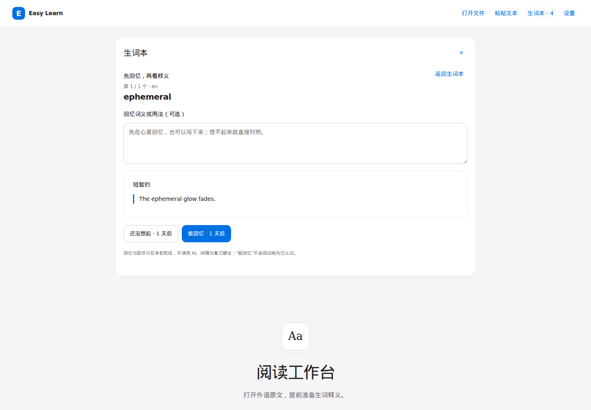
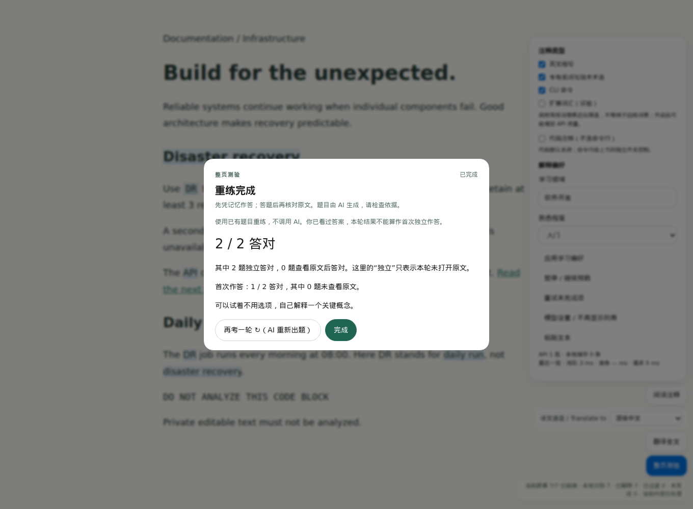

# 常见 AI 学习软件对比与改进记录

核对日期：2026 年 10 月 4 日。比较对象限定为与“阅读材料 → 理解 → 练习 → 复习”有关的常见软件。依据是官方功能说明、公开使用规模、应用商店评价和本仓库源码。本轮没有复制第三方源码，没有使用付费账户实测闭源产品。

## 为什么选择这三款

| 软件                                                  | 使用规模证据                                                                                                                 | 大量反馈证据                                                                                                                                        | 相关 AI 能力                                                                                                                                               |
| ----------------------------------------------------- | ---------------------------------------------------------------------------------------------------------------------------- | --------------------------------------------------------------------------------------------------------------------------------------------------- | ---------------------------------------------------------------------------------------------------------------------------------------------------------- |
| Quizlet                                               | 官方称有 6000 万学生与学习者使用。[官方介绍](https://quizlet.com/gb/mission)                                                 | 美国 App Store 约 110 万条评分，4.8/5；页面可读多篇具体学习反馈。[应用商店](https://apps.apple.com/us/app/quizlet-more-than-flashcards/id546473125) | 笔记生成学习材料、AI 模拟测验。[功能说明](https://help.quizlet.com/hc/en-us/articles/25946589648013-Studying-with-Practice-Tests)                          |
| Duolingo                                              | 官方披露 2025 年第四季度 5270 万日活、1.331 亿月活。[投资者资料](https://investors.duolingo.com/company-strategy-overview-0) | 美国 App Store 约 550 万条评分，4.7/5。[应用商店](https://apps.apple.com/us/app/duolingo-language-lessons/id570060128)                              | AI 情境会话，按学习级别约束对话。[官方设计说明](https://blog.duolingo.com/ai-and-video-call/)                                                              |
| Google NotebookLM（当前商店页面名为 Gemini Notebook） | Google 在移动端发布说明中明确称有数百万使用者。[官方说明](https://blog.google/innovation-and-ai/products/notebooklm-app/)    | 美国 App Store 约 6.2 万条评分，4.9/5，包含具体学习体验反馈。[应用商店](https://apps.apple.com/us/app/gemini-notebook/id6737527615)                 | 根据自有来源制作闪卡、测验及报告。[官方公告](https://workspaceupdates.googleblog.com/2025/09/flashcards-quizzes-reports-notebook-lm-google-education.html) |

评分数量不等于文字评论数量，也不等于活跃用户数；以上分别列出，避免混用。商店数字是核对时的近似值，只覆盖美国 iOS 商店。使用规模说明与大量评价一起支持“常见”的选择标准，不能据此证明某个功能有效。

## 从功能和反馈里看到的问题

Quizlet 的公开评论肯定了把词卡分成会与不会、再练不会部分的流程，也有人指出付费限制和界面可访问性问题。[原始评论页面](https://apps.apple.com/us/app/quizlet-more-than-flashcards/id546473125) 这提示我们：生词收藏需要能直接进入回忆，学习者也应能纠正状态。Easy Learn 原先有 Anki 导出，但本机生词本只展示释义和移除按钮；用户还得离开软件才能复习。开放练习的“我的复习”已经存在，缺口具体发生在阅读工作台的生词本。

Duolingo 把错题、词汇、听说练习集中到 Practice 入口。[官方说明](https://blog.duolingo.com/guide-to-duolingo-practice-hub/) 用户讨论中也有人反映推荐内容太旧、不能指定薄弱词，或做完错题后仍重复同一错误。[反馈一](https://www.reddit.com/r/duolingo/comments/1cmkyao/)、[反馈二](https://www.reddit.com/r/duolingo/comments/1vd2gfg/this_has_to_be_the_worst_daily/) 因此本项目的练习应遵循用户选定的范围。原有整页测验只列出错题和答案，“再考一轮”会重新调用 AI，却不能立即重练本次薄弱题；看原文后答对的题也没有重练入口。

NotebookLM 的闪卡和测验基于用户资料，帮助读者主动处理自己的材料。[官方公告](https://workspaceupdates.googleblog.com/2025/09/flashcards-quizzes-reports-notebook-lm-google-education.html) 商店反馈也提到卡片、测验与不同学习形式的价值，但这些个体反馈不代表学习效果实验。[评论页面](https://apps.apple.com/us/app/gemini-notebook/id6737527615) Easy Learn 已有选段学习、整份 PDF 抽样测验及引用匹配，不缺另一套批量自动出题。发现的具体缺陷是阅读工作台的选段解释直接显示模型返回的引文，没有像测验和开放练习一样核对文字是否出现在输入原文里。

## 已完成的改动

| 原先不足                                   | 本轮结果                                                                               | 使用入口                                          |
| ------------------------------------------ | -------------------------------------------------------------------------------------- | ------------------------------------------------- |
| 生词只有收藏、展示与导出                   | 增加先回忆后揭示释义、按自评安排到期复习，以及本轮未想起词的重练                       | 阅读工作台 → 生词本 → 回忆到期生词 / 练习当前筛选 |
| 收藏丢失原文语境，重复收藏可能丢释义和进度 | 保留短语境；重复收藏沿用复习进度，未加载新解释时保留已有释义                           | 原文词语 → 加入生词本                             |
| 无法直接修正释义或把已认识词恢复为学习中   | 增加编辑释义、标为已认识、重新学习；无参考释义的词提示补充，避免空卡片                 | 生词本中每条词汇的操作                            |
| 重新测验会再请求 AI，不能聚焦本次薄弱题    | 错题和查看原文后答对的题进入本轮重练队列；隐藏答案后再答；持续未独立答对的题可再次重练 | 整页 / PDF 测验结果 → 重练错题与开卷题            |
| 重练容易被当成新的独立测验成绩             | 保留首次结果，并明确重练前已经见过答案；AI 重新出题按钮单独说明其行为                  | 测验重练结果                                      |
| 选段解释的引文可能不在原文中               | 复用既有引用匹配；仅展示可匹配原文的引文，否则显示核对提示                             | 阅读工作台 → 解释选段                             |

生词回忆、手动纠正和同题重练不新增 AI 调用；用户主动选择 AI 重新出题时仍会发送材料。生词的回忆草稿不保存，也不发送给模型。已保存的生词参考保留在本机。

复习间隔复用现有的 1 / 3 / 7 / 14 / 30 天建议。首次回忆后安排 1 天；后续能回忆则逐步延长，未想起则回到 1 天。它不是训练出的个性化记忆模型。“能回忆”不会自动变为“已认识”。标为已认识的词退出复习；重新学习保留原进度，可用“练习当前筛选”提前练习。

旧记录无需迁移，缺少复习字段的旧词直接进入可回忆范围。保存成功才推进卡片；写入失败保留当前卡片，允许重试。跨标签页收到更新时刷新词汇；复习中的词若已被修改或删除，提示跳过。写入前再次核对该词，检测已发生的更新。存储依旧是浏览器 localStorage，整表读改写没有事务锁，真正同时发生的跨标签页写入仍可能覆盖；不能声称已实现完整并发安全或跨设备同步。

引用匹配只说明文字确实出现在所选原文中，不能证明模型解释的推理正确，也不能补足未送给模型的上下文。短于现有匹配器最低长度的引用仍会被视为不可核对。

## 仍存在的差距

| 差距                                                                   | 对应参照                              | 本轮选择                                                                                   |
| ---------------------------------------------------------------------- | ------------------------------------- | ------------------------------------------------------------------------------------------ |
| 没有听说训练与 AI 情境口语                                             | Duolingo 的 AI 会话与听说练习         | 保留为后续产品方向，需要音频服务、费用和权限设计，以及真实口语验证；本轮聚焦阅读后的回忆   |
| 没有可持续管理的多资料学习空间与跨资料核对                             | NotebookLM 的来源笔记本               | 现有阅读工作台一次处理一份材料；多资料组织需要文档存储和索引，不能用简单“上传更多文件”代替 |
| 词汇进度不能跨浏览器、扩展与工作台同步，TSV 导出也不能完整恢复复习进度 | 常见账户型学习产品的持续学习体验      | 仍为本机保存与 Anki 导出；下一步优先考虑可恢复的本地备份，再讨论账户同步                   |
| 缺少根据真实表现验证的难度与复习调度                                   | Quizlet 自适应练习、Duolingo 分级练习 | 本轮提供明确自评与可选择范围，避免把固定间隔和答题次数包装成掌握度                         |

这些仍是实际不足。当前改动主要补齐现有阅读工具内的练习流程，没有把它扩张为课程平台。是否改善长期学习效果，还需要使用者隔天独立回忆和实际应用的观察。

## 验证

- `pnpm lint`：通过。
- `pnpm test`：239 个单元测试通过；包含旧词兼容、复习间隔、损坏元数据、重复收藏、错题重练、首次结果保留，以及无依据引文的处理。
- `pnpm build` 与 `pnpm build:workbench`：通过。
- Linux Chromium 浏览器测试：9 条相关流程全部通过，覆盖原有生词搜索、语言与状态筛选、Anki 导出、释义编辑、到期回忆、忘词重练、刷新恢复、写入失败、多标签页删除、旧词复习后再次收藏、网页测验重练和 PDF 测验；检查窄屏无横向溢出。模型使用本地模拟，验证重练不增加请求。
- 独立只读审查发现并修复旧词复习后再次收藏造成的字段顺序误判；复查与受影响测试通过。改动文件经 Prettier 归一格式。

界面截图见下方，仅使用公开合成测试材料：

