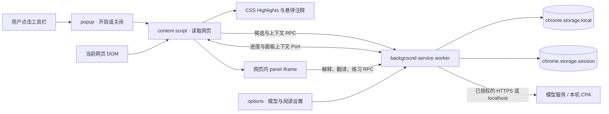

# Easy Learn 项目架构拆解

面向计算机科学与技术专业大三学生。本文以当前源码为准，目标是让你能回答三个问题：**代码在哪个浏览器环境运行、一次用户操作如何穿过各模块、数据和权限由谁管理**。建议先读本文，再按文末顺序打开源码。产品功能与安装步骤见 [README](../README.md)。

## 1. 先建立整体模型

Easy Learn 是一个 **Manifest V3 浏览器扩展**，不是传统的“前端页面 + 自建后端”。它将网页伴读、选段解释、翻译、快测和复习放在几个隔离的浏览器运行环境中。扩展后台代替应用服务器承担消息分发和模型请求，但它仍运行在用户浏览器里；外部 AI 服务或本机 CPA 是独立的模型来源。



各环境的职责如下：

| 环境                    | 主要文件                                                                                                   | 能做什么                                             | 不承担什么                 |
| ----------------------- | ---------------------------------------------------------------------------------------------------------- | ---------------------------------------------------- | -------------------------- |
| 工具栏弹窗              | [popup.tsx](../src/ui/popup.tsx)、[start-reading.ts](../src/ui/start-reading.ts)                           | 找到当前标签页，注入或切换伴读脚本                   | 不分析正文、不直接调用模型 |
| 网页内容脚本            | [content/index.ts](../src/content/index.ts)、[content/](../src/content/)                                   | 读取可见正文、寻找候选、绘制注释、管理网页浮窗       | 不读取保存的 API Key       |
| 扩展后台 Service Worker | [background.ts](../src/background.ts)                                                                      | 检查消息来源与权限、排队、缓存、请求模型、持久化数据 | 不直接操作网页 DOM         |
| 扩展页面                | [options.tsx](../src/ui/options.tsx)、[panel.tsx](../src/ui/panel.tsx)、[review.tsx](../src/ui/review.tsx) | 配置模型、展示解释/翻译、练习和复习                  | 不把密钥注入网页           |
| 模型适配层              | [core/ai.ts](../src/core/ai.ts)、[providers.ts](../src/core/providers.ts)                                  | 组装 Chat Completions 请求、处理流式响应、解析结果   | 不决定网页哪里应被标注     |

这里的“后台”是 Chrome 的 Service Worker，具有事件驱动的生命周期；不要把它理解为一直运行的服务器进程。[connection.ts](../src/core/connection.ts) 在伴读页面或面板打开期间通过 Port 发送扩展内部心跳，这不调用模型。网页中的 panel 以扩展页面 iframe 呈现；PDF 右键选段使用浏览器侧栏，整份 PDF 阅读使用独立的伴读页。

## 2. 从点击图标到出现注释：一条完整链路

以技术文章里的陌生缩写 **DR** 为例：

1. 用户点击图标。[popup.tsx](../src/ui/popup.tsx) 调用 `chrome.scripting.executeScript` 注入 `content.js`。内容脚本在 `globalThis.__easyLearn` 保存切换入口，再次注入会关闭伴读。
2. 内容脚本建立 Shadow DOM 浮窗，并在页面变化时用 `MutationObserver` 重新扫描。[document.ts](../src/content/document.ts) 优先在 `article`、`main`、`[role=main]` 中找段落、列表、标题和代码块，排除导航、广告、输入框等。正文以 `Block` 表示，保留对应 DOM 元素、文本和章节信息。
3. [candidates.ts](../src/content/candidates.ts) 用术语表、缩写模式、技术语境和排除规则找候选。每段通常最多 6 个候选；送模型的单个候选语境最多约 420 字符。路径、域名、普通标题等会尽量在本地过滤。
4. [glossary.ts](../src/content/glossary.ts) 与 [commands.ts](../src/content/commands.ts) 能立即解释部分常见词或命令；未知或有歧义的 DR 才进入模型队列。由此区分了**本地规则的即时结果**和**需要语境判断的模型结果**。
5. [content/index.ts](../src/content/index.ts) 按阅读位置安排待处理项，最多两路并发，每批最多 4 个候选。它通过 [rpc.ts](../src/ui/rpc.ts) 发 `AI` 消息给后台，而不是从网页直接访问模型。
6. [background.ts](../src/background.ts) 用 Zod 校验 `AIRequest`，检查扩展来源和目标域名权限，先查文档会话缓存与持久术语缓存。未命中的请求进入最多两路的 [Queue](../src/core/session.ts)；主动操作比自动预载有更高优先级。
7. [ai.ts](../src/core/ai.ts) 将候选包装为 Chat Completions 请求。自动注释使用 SSE 流；[stream.ts](../src/core/stream.ts) 在网络块可能任意断开的条件下重组事件，识别完整 JSON 条目。后台通过 Port 把已完成条目推回页面，页面不用等整批结束。
8. 内容脚本用 `Range` 和 CSS Custom Highlight API 标注原文。[document.ts](../src/content/document.ts) 的 `matchesSnapshot` 会检查扫描时的文字是否仍与当前 DOM 一致，避免动态页面更新后高亮错位。它不改写原文节点或链接结构。
9. 悬停只显示**已经预载**的内容，不发起模型请求。点击“深入理解 / 翻译”才打开 panel，按需请求更详细的结果。

可以把主链路压缩为：

```text
网页 DOM → Block → Candidate → 本地释义 / 待处理批次
        → 后台权限与缓存 → 模型流 → Concept → Range 高亮 → 悬停卡片
```

**值得注意的取舍：**候选识别偏向高精度，漏掉的内容可以划词主动解释；模型输出也要与原始候选 ID 对应，不能凭一段自由文本随意标到网页上。

## 3. 主动操作是另一条链路

- **解释与翻译**：[panel.tsx](../src/ui/panel.tsx) 根据所选文字构造 `AIRequest`，后台调用模型。翻译只要求返回译文；当前本机 CPA 的 GPT-6 Luna 翻译使用 `reasoning_effort: none`，其他任务使用 `low`。自动注释是流式的，解释和翻译目前等完整响应后展示。
- **选段快测**：[quick-quiz.tsx](../src/ui/quick-quiz.tsx) 只把主动选中的文字送去出四选一题；作答前不展示答案。再次出题才产生新请求。
- **主动练习**：[practice.tsx](../src/ui/practice.tsx) 先请求一道开放题和应用任务，学生作答后再请求反馈。只有点击“保存练习”才通过后台写入本地记录。
- **复习**：[review.tsx](../src/ui/review.tsx) 读取已保存记录，先自行回忆，再揭示第一次的 AI 反馈；自评与实践记录均为本地操作，不再调用模型。
- **PDF 选中文字**：原生 PDF 阅读器不能走普通整页内容脚本。后台的右键菜单获取选区，将其暂存 `chrome.storage.session`；侧栏读取后立即删除这份临时选区。超出 16,000 字符时截断并提示。
- **PDF 伴读页**：[pdf-source.ts](../src/ui/pdf-source.ts) 负责网址授权、下载、本机文件读取和 pdf.js 资源配置；[pdf-document.ts](../src/core/pdf-document.ts) 提取各页文字，读取结束或失败时释放页面和读取任务；[pdf-page.tsx](../src/ui/pdf-page.tsx) 管理单页阅读、选段与学习操作；[pdf.tsx](../src/ui/pdf.tsx) 组织文档、目录和测验。目录来自文件自带书签，读取和导航不请求模型。测验样本与字符统计只在文档页集合变化时重算；导航输入不会重复渲染单页卡片。

这里有两种不同的“记住”：`MASTER` 表示“我已懂，不再显示这条注释”；`LEARNING_SAVE` 表示“保存这道练习供以后复习”。它们的数据结构和用途不同。

## 4. 数据结构、缓存与并发

先看 [types.ts](../src/core/types.ts)。它用 Zod 同时定义运行时校验和 TypeScript 类型：

| 类型          | 作用                                                                        |
| ------------- | --------------------------------------------------------------------------- |
| `Config`      | 模型地址、模型名、访问密钥和学习偏好                                        |
| `TextContext` | 标题、章节、当前文本及可选的邻段/整节                                       |
| `Candidate`   | 本地找出的待解释片段，含 ID、类别和短语境                                   |
| `Concept`     | 可标注到原文的解释结果                                                      |
| `AIRequest`   | `analyze`、`explain`、`choice`、`quiz`、`evaluate`、`pageQuiz` 六种模型任务 |

模型不保证每次严格返回 JSON，所以 [model-output.ts](../src/core/model-output.ts) 先归一化兼容形式，再用 Zod 校验。自动注释还会从不完整的流中保留**已完整且可对应候选的条目**；失败项可单独重试，不自动追加付费修复请求。

| 数据层                            | 保存什么                       | 生命周期                                                   |
| --------------------------------- | ------------------------------ | ---------------------------------------------------------- |
| 内容脚本的 `workByKey` 与本地词典 | 当前页面的候选、状态、即时释义 | 伴读关闭或页面结束即消失                                   |
| 后台 `SessionCache`               | 某文档的完整模型响应           | 内存中，按作用域管理；每个缓存最多 150 条                  |
| `annotationCacheV1`               | 术语、缩写、词汇的短释义       | `chrome.storage.local`；最多 500 条、30 天，语境参与哈希键 |
| `config`、`reading`、`mastered`   | 服务配置、开关、隐藏记录       | `chrome.storage.local`                                     |
| `learningCardsV1`                 | 用户主动保存的练习与实践记录   | `chrome.storage.local`；最多 50 条、约 2 MB                |
| `pdfSelection:<tabId>`            | 右键选中的 PDF 文字            | `chrome.storage.session`；侧栏取走即删除                   |

缓存键会区分模型、服务地址、学习偏好和语境；同为“DR”也不能跨语境直接复用。[Queue](../src/core/session.ts) 限制同时最多两个模型请求，并让主动解释/翻译优先于**排队中**的自动注释，不中断已经发出的请求。内容脚本的 `generation`、面板的 `epoch` 与 `AbortController` 用来丢弃切页、关面板或改设置后的过期结果。学习记录的 `revision` 则处理两个界面同时修改同一条记录的问题。

复习间隔由 [learning.ts](../src/core/learning.ts) 的 `REVIEW_DAYS = [1, 3, 7, 14, 30]` 固定给出：自评“还需练习”回到 1 天，自评“能独立解释”逐级延长。这是调度规则，不是模型预测出的记忆曲线。

## 5. 权限与安全边界

[manifest.json](../public/manifest.json) 声明 `activeTab`、`scripting`、`storage`、右键菜单和侧栏权限。模型主机属于**可选主机权限**；保存配置时 [options.tsx](../src/ui/options.tsx) 请求相应域名授权。外部地址要求 HTTPS；只有 `localhost` 和 `127.0.0.1` 允许 HTTP。

后台首先检查 `sender.id`，再区分扩展自己的 options/panel 页面与网页内容脚本。网页内容脚本只能读经裁剪的 `PUBLIC_SETTINGS`，发起正文 `analyze`，并更新网页浮窗提供的阅读开关与“我懂了”状态；详细解释、翻译、练习和完整设置走受信任的扩展页面。密钥留在受限的扩展存储中，由后台为请求加上 Bearer 头。界面显示模型文本时主要使用 React 文本节点或 `textContent`，避免把模型返回值当网页 HTML 执行。

本机 CPA 是开发机上**独立运行**的代理，不属于扩展包，也不是上架后的默认方案。其凭据和访问密钥放在被 Git 忽略的 `.cache/cpa/`；扩展只连接本机兼容接口。详情见 [Plus 接入记录](chatgpt-plus-integration.md)。

## 6. 如何构建与验证

[build.mjs](../scripts/build.mjs) 分三步调用 Vite：先构建 popup、options、panel 和 sidepanel 四个 HTML 入口，再把后台构建成 ES module，最后把内容脚本构建成可注入页面的 IIFE。TypeScript 的 `noEmit` 只负责类型检查；构建结果在被 Git 忽略的 `dist/`。

```sh
pnpm test
pnpm build
# 浏览器回归测试使用公开样例和本地模拟模型，不使用个人凭据
PLAYWRIGHT_BROWSERS_PATH="$PWD/.cache/ms-playwright" pnpm test:e2e
```

测试分三层：

1. [tests/](../tests/) 中的 Vitest 单元测试验证候选过滤、DOM 提取、模型输出解析、缓存、队列、复习调度和后台权限。
2. [tests/e2e/extension.spec.ts](../tests/e2e/extension.spec.ts) 在 Chromium 中加载真正构建出的扩展，用本地模拟 API 验证从点击到高亮、翻译、练习、复习和 PDF 选区的流程。
3. 真实模型与真实浏览器页面属于人工验收范围；模型质量和特殊网页兼容性不能仅靠模拟接口证明，见 [验收记录](acceptance.md)。

## 7. 推荐阅读顺序与动手练习

**第一遍：追一条消息。** 从 [popup.tsx](../src/ui/popup.tsx) 进入 [content/index.ts](../src/content/index.ts) 的 `start` / `scan`，再看 [background.ts](../src/background.ts) 的 `AI` 分支，最后看 [ai.ts](../src/core/ai.ts)。画出 DR 从候选到高亮的时序图，并标出哪一步能看到密钥。

**第二遍：看算法和状态。** 阅读 [document.ts](../src/content/document.ts)、[candidates.ts](../src/content/candidates.ts)、[session.ts](../src/core/session.ts) 与 [stream.ts](../src/core/stream.ts)。解释为什么需要文本快照、候选 ID、两路并发上限和“只接收完整流式条目”。

**第三遍：看产品数据。** 从 [practice.tsx](../src/ui/practice.tsx) 的“保存练习”按钮追到 [learning.ts](../src/core/learning.ts) 和后台的 `LEARNING_SAVE` 分支。说明为何出题与反馈可以先存在 React 状态里，而持久保存必须由用户主动触发。

可做三个不需要真实 API Key 的小练习：

- 给本地词典新增一个你熟悉的技术概念，并为“有明确语境”和“有歧义语境”各写一个单元测试；确认悬停不增加请求。
- 在测试中构造两个自动注释任务和一个主动翻译任务，验证队列优先处理**尚未开始**的主动任务；再解释为何不能强行抢占已在途请求。
- 在浏览器模拟测试中加入动态改变段落文字的场景，观察 `matchesSnapshot` 如何避免把旧解释画到新文本上。

## 8. 适合在课程讨论的工程取舍

- **规则与模型如何分工？** 本地词典快且可控，模型能处理语境，但慢、有额度、可能出错；项目先筛候选，再让模型补足未知部分。
- **为什么要分层缓存？** 页面工作状态、文档会话结果和 30 天术语缓存的失效条件不同；放进一个全局缓存容易误用旧语境。
- **为什么消息边界要校验两次？** TypeScript 类型在运行时消失；网页与模型输出都可能不可信，后台需要校验来源和数据结构。
- **未来可怎样重构？** [content/index.ts](../src/content/index.ts) 集中管理扫描、调度、浮窗与高亮，适合逐步抽出独立控制器；[background.ts](../src/background.ts) 的字符串消息与 `any` 也可演进为共享的判别联合类型。重构时要保留当前权限边界和浏览器回归测试。
- **适用范围在哪里？** 正文提取依赖常见 DOM 结构与启发式规则；图片、扫描版 PDF、复杂嵌入内容和模型解释质量需要其他能力或人工核对。
