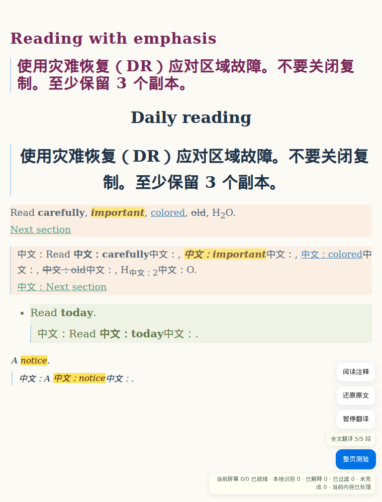

# 网页全文翻译保留文字格式

实现与验证日期：2026-10-03。

## 问题与行为

原实现将段落压成纯文本，译文再使用固定的 system-ui、正常字重、缩小字号和透明度，因而丢失标题层级和段内强调。

译文现在从原文读取实际文字样式：字体、字号、字重、斜体、颜色、背景高亮、行距、字距、对齐、装饰线和上下标。嵌套强调扁平化到对应片段，同时保留祖先高亮与装饰。列表和表格译文仍放在原单元内，背景与透明度不重复叠加。只复制文字属性，不复制定位、脚本、图片、事件或网页类名；原文节点、链接与事件保留。

行内格式使用编号标记传递给现有 explain/translate 请求，同一请求保留整段上下文；纯文本段落保持普通请求。共享 contextSchema 的可选 translationMarker 字段只在标记翻译时补充系统提示。模型可按中文语序移动成对标记，本地校验编号、配对、唯一性和非嵌套关系，然后以 textContent 创建本地 span，绝不执行模型 HTML。源文含相同标记时选择其他前缀。

缺失、重复、未知或错误嵌套标记时，去除保留前缀的标记，展示返回的全部文字并提示格式缺失，不进行付费自动修复。2026-10-04 起，独立且有效的标记仍保留其对应样式；整段格式一致时，未标记译文也保留这套统一样式。仅返回标记的空译文按失败处理。长段落保留完整文本，普通片段最多 2000 字符，含标记的请求最多 4000 字符；切片不拆 UTF-16 代理对，不额外制造段内换行。

class/style、样式表文字和窗口尺寸改变后重新读取样式，复用当前译文。原文字节点、行内父节点或 br 结构变化时，拒绝过期结果并重新翻译。还原、缓存重用、动态正文、暂停/继续、页面移位修复和滚动锚点仍沿用 PageTranslation。

独立审查确认并修复了两项问题：直属普通文字片段会重复叠加根段的透明度/半透明背景；缓存 br 会忽略后续 CSS 隐藏切换和隐藏祖先。普通片段现在复用容器背景/透明度；换行保留源 br 引用，重绘时通过共享正文可见性判断检查完整祖先，无额外模型请求。

## 调研与许可

- [KISS Translator 官方功能说明](https://github.com/fishjar/kiss-translator/blob/dev/README.en.md)提供富文本翻译与文字样式保留的同类功能。本次沿用 Easy Learn 提取器和提供商适配，没有复制其 GPL-3.0 代码或增加依赖。
- [MDN getComputedStyle](https://developer.mozilla.org/en-US/docs/Web/API/Window/getComputedStyle)说明读取样式表、继承和内联样式计算后的实际属性。采用浏览器原生 API，以属性白名单重建译文文字样式。
- 已有网页双语结构、阅读位置问题与来源见 [0.16.0 调研](browser-translation-0.16.md)。本次保持其原文旁插入译文的方式。

## 验证与边界

使用合成网页、本地模型 mock 和 WSL Linux Chromium：比较标题、正文、列表、表格以及段内强调的实际 CSS；覆盖嵌套加粗/斜体/高亮、装饰线、上下标、链接文字样式、连续换行、源 DOM 身份、响应式字号、缓存切换和零额外请求。测试运行会生成被 Git 忽略的 `test-results/full-page-translation-format.png`，已将回归截图归档到下方供 PR 审查。截图使用合成页面与本机 mock，只验证样式保留。

单元验证另覆盖中文语序移动、无效标记安全回退、仅标记输出、标记碰撞、密集长段落的预算和完整性，以及结构变化期间的过期响应。全套单元测试与扩展构建通过；全文翻译浏览器回归通过。此处 mock 验证格式协议和渲染，不证明所有上游模型都能保留标记或准确翻译。

文字样式保留不等于网页像素完全相同：译文长度与字体中文字形会影响换行；伪元素、图片文字、复杂渐变背景及交互控件仍不重建。译文链接保留文字外观，点击行为由保留的原文链接提供。上游未保留格式标记时有明确回退提示。

## 2026-10-04：复杂商店页面与格式容错

参考用户提供的 [OK24Shop 首页](https://ok24shop.com/)，按实际块边界和 CSS 布局分组文本，混合容器在嵌套块前后的连续行内文字各自成为翻译单元。用首个源文字节点区分同一容器的多个单元，译文插在对应片段之后；列表、单元格、按钮和独立链接内保留译文。原文节点不拆分、不包裹，也不替换。单元复用同时检查根元素和片段边界，CSS 改变块结构时重新定位。

真实 Chromium 检查该站当前页面：189 个符合翻译过滤条件且含字母的文字节点全部被提取，无重复；使用本地内存 mock 成功呈现 188 段，原元素全部保持连接，未检测到译文整段被祖先 overflow 完全裁剪。这是当前页面的提取和呈现检查，不证明真实模型翻译质量或所有动态状态。

新增合成商店浏览器回归覆盖泰文短标签、grid / flex 商品卡片、混合文字、页眉导航、页脚、标记部分缺失和全部缺失时的字号 / 加粗 / 斜体、响应式字号、缓存恢复与链接；截图输出到被 Git 忽略的 `test-results/complex-shop-translation.png`。独立审查发现并修复：混合容器中的换行快照必须只关联当前片段，避免嵌套段落改动触发相邻片段重复请求；CSS 改变单元根元素时不能复用旧放置位置。两项均有单元回归。
