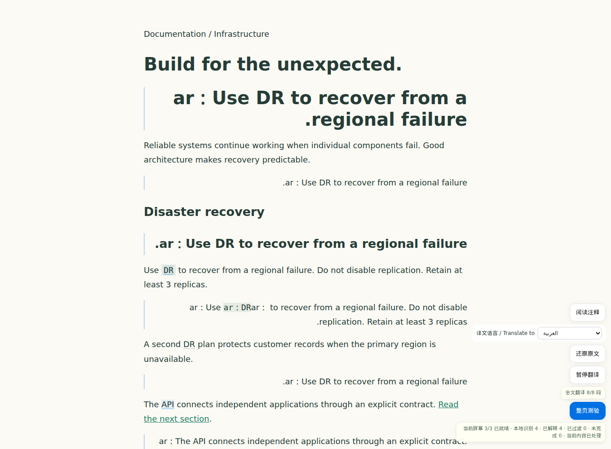

# 多语言翻译

翻译目标支持简体中文、繁体中文、英语、法语、日语、韩语、德语、西班牙语、葡萄牙语、意大利语、俄语、阿拉伯语、印地语、越南语、印度尼西亚语和泰语。菜单使用语言本名，便于不同地区的用户选择；原有输入语言、文档导入、生词筛选、释义和测验保持现有行为。

- **默认语言**：在扩展设置或工作台连接设置的「默认译文语言 / Default translation language」选择。工作台需要点击「保存连接」；扩展偏好即时保存。旧设置默认仍为简体中文。
- **网页全文**：在浮窗的「译文语言 / Translate to」选择本页语言，再点击「翻译全文」。切换语言会移除旧译文、取消旧请求并暂停，点击「继续翻译」才开始新语言；原文、链接、事件和阅读位置保留。
- **选区、粘贴和 PDF**：学习面板、工作台选段学习及 PDF 文本阅读页均有语言选择。工作台选段更换语言后点击「翻译 / Translate」；面板在翻译模式更换语言时直接翻译当前选段。临时选择不覆盖已保存的默认值。

翻译输出标注对应的 `lang` 和书写方向，支持阿拉伯语从右向左展示。不同目标语言使用不同请求缓存键；返回中的文本不会作为 HTML 执行。语言选择不会触发新的模型服务、登录或外部上传，仍使用用户已配置的模型与额度。

语言白名单、目标语言提示词、默认偏好、缓存隔离、切换时的取消和旧响应过滤使用本地模型模拟验证；真实译文质量取决于所配置模型。界面整体仍使用简体中文，这次扩展的是译文语言。
